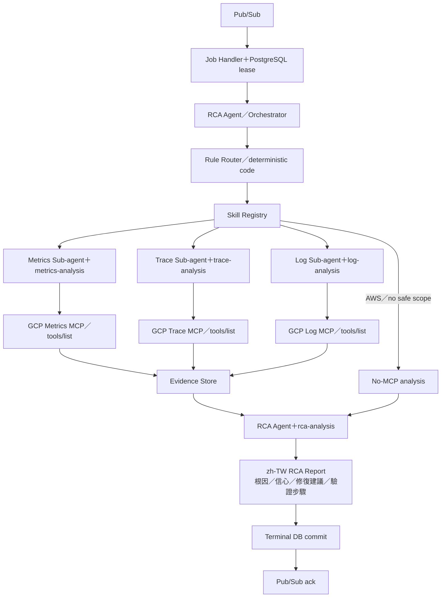

# Pub/Sub Emulator 與 RCA Worker 實作計畫

> **給自動化實作者：** 必須使用 `superpowers:subagent-driven-development`（建議）或 `superpowers:executing-plans`，逐項執行本計畫。所有步驟使用核取方塊（`- [ ]`）追蹤。

**目標：** 透過 Google Pub/Sub 傳遞每一筆已提交的 RCA job，在五分鐘內完成具冪等性、唯讀且有證據支持的 RCA，並永久保存繁體中文的 `COMPLETE`／`PARTIAL`／`FAILED` 報告。

**架構：** `rca-worker/` 是獨立的 Python 套件與部署單位，絕不 import `backend/src`。PostgreSQL 是唯一資料真相來源；Backend transactional outbox 將契約定義的小型工作訊息發布到 Pub/Sub，RCA Worker 取得資料庫 job lease 後才呼叫 specialists。本機開發與整合測試使用 Google 官方 Pub/Sub Emulator，並共用正式環境使用的 Google client-library adapters。ADK 與 MCP API 必須封裝在 typed adapters 後方；telemetry 一律視為不可信資料，每個觀察性結論都必須引用已保存的 evidence。



**技術棧：** Python 3.11+、asyncio、SQLAlchemy async、PostgreSQL 18、Google Cloud Pub/Sub client、Google 官方 Pub/Sub Emulator、固定於 `uv.lock` 的 Google ADK、MCP、Pydantic v2、pytest。

## 全域限制

- 本計畫必須等 `2026-08-13-grafana-normalization-operator-ui-plan.md` 完成後才能執行。
- `rca-worker/` 擁有自己的 `pyproject.toml`、`uv.lock`、tests、Alembic 設定、Dockerfile、CLI、image、CI/build 與 release version。
- `rca-worker/` 與 `backend/` 不得互相 import source；共用資料格式放在 `contracts/`，並由兩個套件各自驗證。
- Backend、RCA Worker 與兩套 Alembic 共用同一 application role，但 Alembic version tables 與 migration ownership 仍分開。
- Pub/Sub 訊息只能包含 schema version 與工作識別碼，絕不能包含 AlertValues、原始 webhook、labels、evidence、prompt、token 或 credential。
- 本機與 CI 使用 Google 官方 Pub/Sub Emulator，不使用假 broker；unit tests 可以使用 fakes。
- 正式 Pub/Sub 使用 Workload Identity／ADC，絕不使用 service-account key。
- RCA 從 `QUEUED` 起算 deadline 為 300 秒；lease 為 60 秒；最多永久記錄 3 次嘗試。
- Pub/Sub 採 at-least-once delivery；由 PostgreSQL job/report state 提供冪等性。
- 必須先提交 evidence/report transaction，才能 ack Pub/Sub 訊息。
- 只有非空白 `resource.label.project_id` 且 normalized scope 安全時，才啟用 GCP MCP。
- AWS 本期沒有 MCP endpoint；任何 AWS 告警都不得啟用 GCP MCP。
- 沒有安全 scope 時仍執行 RCA，但不提供 MCP tools；證據不足時產生 `PARTIAL` 報告。
- MCP tools 必須明確為 read-only、通過 capability allowlist、綁定 endpoint，並完成 schema validation。
- RCA Agent 是唯一 orchestrator/synthesizer；Rule Router 是 deterministic code，不是 LLM agent，且不得把 AlertValues 當作 routing 指令。
- 預設 GCP MCP endpoints 固定為 `https://agentgateway.cp.gcubut.gcp.uwccb/agw/gcp-metrics-mcp`、`https://agentgateway.cp.gcubut.gcp.uwccb/agw/gcp-trace-mcp`、`https://agentgateway.cp.gcubut.gcp.uwccb/agw/gcp-log-mcp`，目前不使用 authentication。
- Worker 啟動時使用標準 `tools/list` 探索實際 tool names，再套用 endpoint-bound capability allowlist；job payload 不得指定 URL 或 tool name。
- AWS 本期沒有 MCP endpoint；不得呼叫 GCP MCP，必須產生明示缺少 AWS MCP 證據的 `PARTIAL` 報告。
- AlertValues、telemetry、logs、traces 與 MCP output 都是不可信資料，絕不能視為指令。
- 原始 evidence 以精確 `BYTEA`、結構化 `JSONB`、SHA-256、provenance 與安全 metadata 保存。
- 每一項報告 claim 都必須引用 evidence UUID 與 partition timestamp。
- AI 敘述使用繁體中文；技術證據保持原文。
- 不包含 Chat、conversation worker、Router follow-up、SSE、WebSocket 或正式 infrastructure provisioning。

---

## 檔案配置

- `docker-compose.yml`：僅提供本機 PostgreSQL 與官方 Pub/Sub Emulator。
- `contracts/schemas/rca-job-message-v1.json`：共用 Pub/Sub 訊息契約。
- `contracts/database/table-ownership.yaml`：唯一 migration owner 契約。
- `backend/src/sre_agent/integrations/pubsub/`：只包含 Backend publisher adapter。
- `backend/src/sre_agent/workers/outbox_worker.py`：transaction commit 後發布完整 RCA 識別訊息。
- `rca-worker/src/sre_rca_worker/integrations/pubsub/`：subscriber/bootstrap 與 Worker 端訊息驗證器。
- `rca-worker/src/sre_rca_worker/agents/`：Skills、specialists、orchestration 與 synthesis。
- `rca-worker/src/sre_rca_worker/agents/rca/router.py`：只依 trusted context/capabilities 產生 deterministic RoutePlan。
- `rca-worker/src/sre_rca_worker/integrations/mcp/`：依 endpoint 隔離的 capability adapters。
- `rca-worker/src/sre_rca_worker/application/rca/`：job claim、evidence persistence 與 report settlement。
- `rca-worker/src/sre_rca_worker/workers/rca_worker.py`：Pub/Sub delivery handler 與 process entrypoint。
- `rca-worker/migrations/versions/0001_rca_worker_v1.py`：legacy Backend baseline 後的第一個 Worker-owned migration。
- `rca-worker/tests/`：unit、PostgreSQL 18、Emulator、contract 與 evaluation tests。

---

### 任務 0：建立獨立 RCA Worker 套件與 ownership 契約

**檔案：**
- 建立：`rca-worker/pyproject.toml`
- 建立：`rca-worker/uv.lock`
- 建立：`rca-worker/alembic.ini`
- 建立：`rca-worker/migrations/env.py`
- 建立：`rca-worker/src/sre_rca_worker/__init__.py`
- 建立：`rca-worker/tests/unit/test_package_boundary.py`
- 建立：`rca-worker/Dockerfile`
- 修改：`Makefile`
- 修改：`README.md`
- 修改：`contracts/database/table-ownership.yaml`
- 修改：`contracts/compatibility-tests/test_contracts.py`

**介面：**
- 產出：獨立 import root `sre_rca_worker`，所有 project commands 以 `rca-worker/` 為根目錄。
- 產出：Alembic version table `alembic_version_rca_worker`；Backend 保持使用 `alembic_version_backend`。
- 產出：適用共用 application role、可由機器讀取的 table migration ownership contract。

- [ ] **步驟 1：先寫 package boundary 與 ownership RED tests**

確認 `rca-worker/pyproject.toml`、lock、Dockerfile、migrations 與 package 都存在；掃描 Worker Python AST imports，拒絕任何 `sre_agent` import。解析 `table-ownership.yaml`，確認每張 catalog table 恰有一個 `migrationOwner`、Backend migrations 不能修改 Worker-owned tables、Worker migrations 不能修改 core tables，且 manifest 宣告共用 application role。確認根目錄 `Makefile` 提供 `test-rca-worker`，且 `check` 除 contracts、Backend、Frontend gates 外也依賴此 target。

- [ ] **步驟 2：執行並確認 RED**

Run: `UV_CACHE_DIR=$PWD/.uv-cache uv run --project backend pytest contracts/compatibility-tests/test_contracts.py -v`

預期：因 `rca-worker/` 與 ownership manifest 尚不存在而 FAIL。

- [ ] **步驟 3：建立獨立套件**

設定 project name 為 `sre-rca-worker`、import root 為 `sre_rca_worker`、Python `>=3.11`，並配置自己的 dev tools；不得加入指向 `backend` 的 editable/path dependency。設定 Alembic `version_table = alembic_version_rca_worker`。Backend 改用 `version_table = alembic_version_backend`，並提供精確的轉換 helper：在單一 transaction 中，若只有 legacy `alembic_version`，將它改名為 `alembic_version_backend`；若兩者都不存在，正常建立／使用 Backend table；若兩者同時存在，必須確認各自唯一 revision value 相同，才能只刪除多餘的 legacy table，否則不得修改並直接失敗。PostgreSQL integration tests 必須涵蓋四種 catalog states。不得只為建立新的 version-table 名稱而重跑 initial DDL。

新增 `make test-rca-worker`，從 `rca-worker/` 執行 Worker pytest、Ruff 與 Pyright；根目錄 `check` 必須呼叫 contracts、Backend、Worker 與 Frontend，且不可共用 virtual environment。同步更新 README setup 與 verification commands，使其符合實際 targets。

- [ ] **步驟 4：定義共用 role 下的 migration ownership**

宣告 Backend 擁有 source/delivery/alert/Incident/outbox/audit tables 的 migration ownership；Worker 擁有 `rca_runs`、`specialist_runs`、`evidence_records`、`rca_hypotheses`、`hypothesis_evidence`、`rca_reports`、`worker_jobs` 與 `worker_attempts` 的 migration ownership。Backend runtime、Worker runtime、Backend Alembic 與 Worker Alembic 共用一個 application role。Manifest 記錄 code-level access intent，不假裝 PostgreSQL 能在相同 credential 下區分兩個服務。

- [ ] **步驟 5：驗證 package isolation 並提交**

Run: `cd rca-worker && UV_CACHE_DIR=$PWD/.uv-cache uv sync --frozen && UV_CACHE_DIR=$PWD/.uv-cache uv run pytest tests/unit/test_package_boundary.py -v`

再次執行步驟 2 的 compatibility test。預期：PASS。

```bash
git add rca-worker contracts/database/table-ownership.yaml contracts/compatibility-tests/test_contracts.py backend/migrations/env.py Makefile README.md
git commit -m "build: scaffold independent RCA worker package"
```

---

### 任務 1：定義並發布 RCA 工作訊息

**檔案：**
- 建立：`contracts/schemas/rca-job-message-v1.json`
- 建立：`backend/src/sre_agent/integrations/pubsub/messages.py`
- 建立：`rca-worker/src/sre_rca_worker/integrations/pubsub/messages.py`
- 修改：`backend/src/sre_agent/workers/outbox_worker.py`
- 修改：`backend/src/sre_agent/persistence/repositories/jobs.py`
- 修改：`backend/tests/integration/workers/test_outbox_worker.py`
- 測試：`backend/tests/unit/integrations/pubsub/test_messages.py`
- 測試：`rca-worker/tests/contract/test_rca_job_message.py`

**介面：**
- 產出：`RcaJobMessage(schema_version: Literal[1], worker_job_id: UUID, rca_run_id: UUID, incident_id: UUID, attempt: Literal[1])`。
- 產出：兩個套件各自實作等價的本地 `RcaJobMessage` adapter，並分別依 `contracts/schemas/rca-job-message-v1.json` 驗證；任何一方都不能 import 對方的 model。

- [ ] **步驟 1：先寫嚴格的 message RED tests**

```python
def test_rca_job_message_is_canonical_and_minimal():
    encoded = message.to_bytes()
    assert json.loads(encoded) == {
        "schemaVersion": 1,
        "workerJobId": str(worker_job_id),
        "rcaRunId": str(rca_run_id),
        "incidentId": str(incident_id),
        "attempt": 1,
    }
    assert b"AlertValues" not in encoded
```

拒絕額外 keys、未知 version、錯誤 UUID types、不是 1 的 attempt，以及超過固定小型上限（例如 1 KiB）的 payload。
將相同的已提交 valid/invalid examples 傳入兩個 package adapters，確認產出的 canonical bytes 完全相同。

- [ ] **步驟 2：執行並確認 RED**

Run: `cd backend && UV_CACHE_DIR=$PWD/.uv-cache uv run pytest tests/unit/integrations/pubsub/test_messages.py -v`

Run: `cd rca-worker && UV_CACHE_DIR=$PWD/.uv-cache uv run pytest tests/contract/test_rca_job_message.py -v`

預期：因 module 尚不存在而在 collection 階段 FAIL。

- [ ] **步驟 3：實作 Pydantic message**

先定義 JSON Schema。Backend 與 Worker 分別實作相同的 `ConfigDict(extra="forbid", frozen=True, populate_by_name=True)` 契約，canonical serialization 使用 `json.dumps(self.model_dump(by_alias=True, mode="json"), sort_keys=True, separators=(",", ":"))`。Compatibility tests 必須將兩個 adapters 與共用 schema/examples 比對。

- [ ] **步驟 4：讓 `create_rca_work` 將所有識別碼寫入 outbox payload**

先 insert worker job 並使用 `RETURNING id` 取得識別碼，再寫入 payload：

```json
{"schemaVersion":1,"workerJobId":"10000000-0000-0000-0000-000000000001","rcaRunId":"20000000-0000-0000-0000-000000000002","incidentId":"30000000-0000-0000-0000-000000000003","attempt":1}
```

保留 `idempotency_key = rca-run:{rca_run_id}`，並強制每個 run/type 只能有一筆 job。

- [ ] **步驟 5：發布已保存的 payload，不可重組通用 envelope**

修改 `OutboxPublisher` query 以選取 `payload`；遇到 `RCA_RUN_REQUESTED` 時用 `RcaJobMessage.from_mapping` 驗證、發布 `message.to_bytes()`，並保留 `idempotencyKey` attribute。若已保存 payload 不符合 schema，必須拋出 `OutboxInvariantError`、rollback 整批 transaction，並讓 publisher run 明確終止以供 operator 修正；不得將它歸類為暫時性 Pub/Sub failure，也不得默默延後 `available_at`。

- [ ] **步驟 6：執行 unit 與 PostgreSQL integration tests**

Run: `cd backend && MIGRATION_TEST_DATABASE_URL=postgresql+asyncpg://postgres@127.0.0.1:55432/sre_agent UV_CACHE_DIR=$PWD/.uv-cache uv run pytest tests/unit/integrations/pubsub/test_messages.py tests/integration/workers/test_outbox_worker.py -v`

再次執行步驟 2 的 Worker contract test。

預期：全部 PASS，包括 cancellation settlement tests。

- [ ] **步驟 7：提交**

```bash
git add contracts/schemas/rca-job-message-v1.json backend/src/sre_agent/integrations/pubsub/messages.py backend/src/sre_agent/workers/outbox_worker.py backend/src/sre_agent/persistence/repositories/jobs.py backend/tests rca-worker/src/sre_rca_worker/integrations/pubsub/messages.py rca-worker/tests/contract/test_rca_job_message.py
git commit -m "feat: publish typed RCA work messages"
```

---

### 任務 2：加入官方 Pub/Sub Emulator 與 bootstrap

**檔案：**
- 修改：`docker-compose.yml`
- 建立：`rca-worker/src/sre_rca_worker/integrations/pubsub/bootstrap.py`
- 建立：`rca-worker/src/sre_rca_worker/integrations/pubsub/subscriber.py`
- 建立：`rca-worker/src/sre_rca_worker/config/settings.py`
- 建立：`backend/src/sre_agent/workers/outbox_main.py`
- 修改：`backend/pyproject.toml`
- 建立：`rca-worker/tests/integration/pubsub/conftest.py`
- 建立：`rca-worker/tests/integration/pubsub/test_emulator_delivery.py`
- 修改：`README.md`

**介面：**
- 產出：`ensure_topic_and_subscription(project_id: str, topic_id: str, subscription_id: str) -> None`。
- 產出：`PubSubDelivery(data: bytes, ack: Callable[[], None], nack: Callable[[], None])` adapter。
- 產出 settings `pubsub_subscription_id`；optional `pubsub_emulator_host` 只允許在非 production 使用。
- 產出 worker CLI `sre-agent-outbox-worker`；設定 Emulator 時使用 Emulator，否則使用 ADC。

- [ ] **步驟 1：先寫 Compose 與 delivery RED tests**

加入 semantic YAML assertion，確認 `pubsub-emulator` service 使用 Google 官方 image、精確 version、loopback binding，且不含 credential：

```python
assert service["image"] == "google/cloud-sdk:578.0.0-emulators"
assert service["platform"] == "linux/amd64"
assert service["ports"] == ["127.0.0.1:58085:8085"]
```

Integration test 必須建立隔離的 topic/subscription，透過 `GooglePubSubPublisher` 發布、由 subscriber pull，先 nack 一次、觀察 redelivery，最後 ack。

- [ ] **步驟 2：加入 service 前先執行 RED**

Run: `UV_CACHE_DIR=$PWD/.uv-cache uv run --project backend pytest contracts/compatibility-tests/test_contracts.py -v`

Run: `cd rca-worker && UV_CACHE_DIR=$PWD/.uv-cache uv run pytest tests/integration/pubsub/test_emulator_delivery.py -v`

預期：因 Compose service/bootstrap/subscriber 尚不存在而 FAIL。

- [ ] **步驟 3：加入官方 Emulator service**

只加入本機開發支援：

```yaml
pubsub-emulator:
  image: google/cloud-sdk:578.0.0-emulators
  platform: linux/amd64
  command: ["gcloud", "beta", "emulators", "pubsub", "start", "--project=sre-agent-local", "--host-port=0.0.0.0:8085"]
  ports: ["127.0.0.1:58085:8085"]
  healthcheck:
    test: ["CMD-SHELL", "python3 -c 'import socket; socket.create_connection((\"127.0.0.1\",8085),2)'" ]
```

不得建立 `infrastructure/` 目錄或任何 production resources。

- [ ] **步驟 4：實作具冪等性的 client-library bootstrap**

使用 `PublisherClient`／`SubscriberClient`；接受 `AlreadyExists`，其餘 errors 必須向上傳遞。設定 `PUBSUB_EMULATOR_HOST` 時，client libraries 使用 Emulator 且不帶 credentials。Production 必須拒絕 emulator host 並依賴 ADC。

將 `outbox_main.py` 實作為 production composition root：建立 async engine/session factory、組合 Google publisher 與 `OutboxPublisher`、持續發布有上限的 batches 直到 shutdown，並在 `finally` 關閉 Pub/Sub client/engine。加入 `sre-agent-outbox-worker = "sre_agent.workers.outbox_main:main"`；安全的 startup failure 回傳 exit code 1，不得輸出 settings 或 secrets。

- [ ] **步驟 5：啟動 Emulator 並執行真實 integration tests**

Run: `docker compose up -d pubsub-emulator`

Run: `cd rca-worker && PUBSUB_EMULATOR_HOST=127.0.0.1:58085 PUBSUB_PROJECT_ID=sre-agent-test UV_CACHE_DIR=$PWD/.uv-cache uv run pytest tests/integration/pubsub/test_emulator_delivery.py -v`

預期：PASS，且確實觀察到 redelivery 與 ack。

- [ ] **步驟 6：提交**

```bash
git add docker-compose.yml rca-worker/src/sre_rca_worker/integrations/pubsub rca-worker/src/sre_rca_worker/config rca-worker/tests/integration/pubsub backend/src/sre_agent/workers/outbox_main.py backend/pyproject.toml README.md contracts/compatibility-tests/test_contracts.py
git commit -m "feat: run RCA delivery on Pub/Sub Emulator"
```

---

### 任務 3：加入 RCA Worker schema、leases、attempts 與精確 evidence

**檔案：**
- 建立：`rca-worker/migrations/versions/0001_rca_worker_v1.py`
- 建立：`rca-worker/tests/integration/persistence/test_schema.py`
- 建立：`rca-worker/tests/unit/persistence/test_schema_documentation.py`
- 修改：`docs/database/postgresql-schema.md`
- 修改：`contracts/database/table-ownership.yaml`

**介面：**
- 產出：Worker lease fields、精確 evidence bytes/metadata、安全 failure codes 與 report status constraints。
- 依賴：Backend schema revision `0002_grafana_normalization_v2` 是外部前置條件，不是 Worker version chain 中的 Alembic `down_revision`。
- 產出：記錄於 `alembic_version_rca_worker` 的 Worker revision `0001_rca_worker_v1`。

- [ ] **步驟 1：先寫 catalog RED tests**

確認 worker jobs 包含 `lease_owner`、`lease_expires_at` 與 `attempt_count CHECK 0..3`；RCA runs、specialist runs 與 worker attempts 保存 allowlisted `failure_code`，不保存敏感 exception text。確認 evidence 具有 `raw_result BYTEA`、`structured_data JSONB`、`metadata JSONB`、`content_hash` 與 partitioned PK。確認 report result status 僅允許 `COMPLETE|PARTIAL|FAILED`。

- [ ] **步驟 2：執行 PostgreSQL 18 RED**

先執行 Backend migration，再執行 Worker RED：

`cd backend && POSTGRES_URL=postgresql+asyncpg://postgres@127.0.0.1:55432/sre_agent uv run alembic upgrade head`

`cd rca-worker && POSTGRES_URL=postgresql+asyncpg://postgres@127.0.0.1:55432/sre_agent uv run alembic upgrade head && MIGRATION_TEST_DATABASE_URL=postgresql+asyncpg://postgres@127.0.0.1:55432/sre_agent uv run pytest tests/integration/persistence/test_schema.py -v`

預期：因缺少 worker/evidence columns 而 FAIL。

- [ ] **步驟 3：實作 Worker revision `0001_rca_worker_v1`**

Migration 開始時查詢 `alembic_version_backend`；若必要的 Backend head/revision 不存在，必須安全失敗。第一個 Worker revision 接管已存在的 legacy RCA/worker tables：先驗證精確 baseline columns/constraints，再原地 alter；不得重新建立或刪除它們。Named CHECK/FK/indexes 只能建立在 Worker-owned tables。只有在以 empty bytes/metadata 與明確 legacy marker backfill legacy rows 後，才能替換 `raw_result_reference`。加入 allowlisted `failure_code` columns，並從 `rca_runs`、`specialist_runs` 與 `worker_attempts` 移除 legacy `error_message` columns；downgrade 時將其重建為 nullable，但不得嘗試還原已捨棄的敏感文字。為 `rca_reports` 加入 `result_status`，只允許 `COMPLETE|PARTIAL|FAILED`；為 `(status, available_at, lease_expires_at)` 建立 index。Worker downgrade 到 base 只反轉 Worker 新增的變更，保留 installed baseline 所擁有的 legacy tables/data。不得修改 core Incident/Alert/outbox DDL。

- [ ] **步驟 4：驗證 downgrade/upgrade 與文件一致性**

Backend 保持在 head，依序執行 Worker downgrade 至 `base`、Worker upgrade 至 `head`、schema tests、ownership contract tests 與 documentation parser tests。預期：PASS。文件必須說明 downgrade 造成的 evidence 資料損失，以及 Backend → Worker 的必要 migration 順序。

- [ ] **步驟 5：提交**

```bash
git add rca-worker/migrations/versions/0001_rca_worker_v1.py rca-worker/tests/integration/persistence/test_schema.py rca-worker/tests/unit/persistence/test_schema_documentation.py docs/database/postgresql-schema.md contracts/database/table-ownership.yaml
git commit -m "feat: add durable RCA worker schema"
```

---

### 任務 4：加入嚴格的 Skill registry 與不可信資料邊界

**檔案：**
- 建立：`rca-worker/src/sre_rca_worker/agents/skills/models.py`
- 建立：`rca-worker/src/sre_rca_worker/agents/skills/loader.py`
- 建立：`rca-worker/src/sre_rca_worker/agents/skills/registry.py`
- 建立：`rca-worker/src/sre_rca_worker/agents/skills/definitions/metrics-analysis/SKILL.md`
- 建立：`rca-worker/src/sre_rca_worker/agents/skills/definitions/trace-analysis/SKILL.md`
- 建立：`rca-worker/src/sre_rca_worker/agents/skills/definitions/log-analysis/SKILL.md`
- 建立：`rca-worker/src/sre_rca_worker/agents/skills/definitions/rca-analysis/SKILL.md`
- 測試：`rca-worker/tests/unit/agents/skills/test_registry.py`

**介面：**
- 產出：`SkillSpec(name, agent, description, required_capabilities, risk, body)`。
- 產出：`SkillRegistry.get_for_agent(agent_name: str) -> SkillSpec`。

- [ ] **步驟 1：先寫 registry RED tests**

確認存在四個不重複 skills、specialists 的 required capabilities 非空、`risk == READ_ONLY`、YAML frontmatter 嚴格驗證、definitions 不含 tool names/endpoints，並包含 zh-TW report rule、evidence citation rule，以及明確聲明 AlertValues/telemetry/tool output 是資料而非指令。

- [ ] **步驟 2：執行 RED**

Run: `cd rca-worker && UV_CACHE_DIR=$PWD/.uv-cache uv run pytest tests/unit/agents/skills/test_registry.py -v`

預期：collection FAIL。

- [ ] **步驟 3：實作嚴格 loader 與 definitions**

以 Pydantic `extra="forbid"` 解析 frontmatter；拒絕重複名稱、path traversal、缺少必要 sections、mutation risk 與直接 tool names。只能定義 canonical capabilities。

- [ ] **步驟 4：執行測試並提交**

執行任務 4 tests。預期：PASS。

```bash
git add rca-worker/src/sre_rca_worker/agents/skills rca-worker/tests/unit/agents/skills
git commit -m "feat: add read-only RCA skill registry"
```

---

### 任務 5：固定 ADK 版本並依 endpoint 隔離 MCP capabilities

**檔案：**
- 修改：`rca-worker/pyproject.toml`
- 修改：`rca-worker/uv.lock`
- 建立：`rca-worker/src/sre_rca_worker/integrations/mcp/models.py`
- 建立：`rca-worker/src/sre_rca_worker/integrations/mcp/client.py`
- 建立：`rca-worker/src/sre_rca_worker/integrations/mcp/capability_resolver.py`
- 建立：`rca-worker/src/sre_rca_worker/integrations/mcp/factories.py`
- 修改：`rca-worker/src/sre_rca_worker/config/settings.py`
- 測試：`rca-worker/tests/unit/integrations/mcp/test_capability_resolver.py`
- 測試：`rca-worker/tests/contract/mcp/test_endpoint_isolation.py`

**介面：**
- 產出：`McpClient.list_tools()`、`McpClient.call(tool_name, arguments, deadline)`。
- 產出：`CapabilityResolver.resolve(required, manifest, discovered) -> tuple[AllowedTool, ...]`。
- 產出：`CapabilitySet(by_specialist: Mapping[SpecialistKind, tuple[AllowedTool, ...]])`，只包含通過 endpoint、read-only annotation 與 input schema 驗證的 tools。
- 產出：`McpClientFactory.for_specialist(kind, scope) -> McpClient`，不接受任意 endpoint argument。
- 產出：三個預設 HTTPS endpoint settings，僅可在 startup configuration 覆寫，且 MCP client 不傳送 authentication material。

- [ ] **步驟 1：先寫 allowlist/isolation RED tests**

測試缺少或模糊 capability 時 fail closed；拒絕 mutation/unknown annotations；endpoint identity 必須符合 trusted manifest；Metrics 不得呼叫 Log/Trace tools；invalid input schema 必須在連網前拒絕；沒有 scope 時回傳不建立連線的 empty client。確認預設 URLs 精確相符、三個 clients 都先呼叫 `tools/list`、requests 不含 Authorization/cookie/credential，且 job/AlertValues 無法覆寫 endpoint。確認 provider = AWS 時三個 GCP clients 都不建立、不連線。

- [ ] **步驟 2：執行 RED**

Run: `cd rca-worker && UV_CACHE_DIR=$PWD/.uv-cache uv run pytest tests/unit/integrations/mcp tests/contract/mcp -v`

預期：collection FAIL。

- [ ] **步驟 3：加入官方 Google ADK 與 MCP dependencies 並精確鎖版**

執行 `cd rca-worker && UV_CACHE_DIR=$PWD/.uv-cache uv add google-adk mcp`，提交 Worker-owned `uv.lock`，絕不使用 floating runtime install。Backend 不得增加 ADK/MCP dependencies。所有 SDK imports 必須封裝在 Worker adapter modules 內。

- [ ] **步驟 4：實作 trusted capability manifest 與 factories**

Manifest entries 包含 endpoint identity、capabilities、allowed tool-name pattern、input schema hash 與 `READ_ONLY`。預設 endpoints 為：

```text
metrics = https://agentgateway.cp.gcubut.gcp.uwccb/agw/gcp-metrics-mcp
trace   = https://agentgateway.cp.gcubut.gcp.uwccb/agw/gcp-trace-mcp
log     = https://agentgateway.cp.gcubut.gcp.uwccb/agw/gcp-log-mcp
```

三個 endpoints 目前不需要 authentication。Factory 只能從 validated startup settings 取得 URL，不接受 agent、job 或 request 傳入 endpoint。啟動時呼叫 `tools/list` 後，以 manifest 過濾實際 tools；不得將未允許、schema 不符或非 read-only tool 暴露給 specialist。

- [ ] **步驟 5：執行 tests/static checks 並提交**

執行任務 5 tests、Ruff 與 Pyright。預期：PASS／0 errors。

```bash
git add rca-worker/pyproject.toml rca-worker/uv.lock rca-worker/src/sre_rca_worker/integrations/mcp rca-worker/src/sre_rca_worker/config/settings.py rca-worker/tests/unit/integrations/mcp rca-worker/tests/contract/mcp
git commit -m "feat: isolate RCA MCP capabilities"
```

---

### 任務 6：定義 specialist 與 evidence contracts

**檔案：**
- 建立：`rca-worker/src/sre_rca_worker/domain/evidence/models.py`
- 建立：`rca-worker/src/sre_rca_worker/agents/specialists/base.py`
- 建立：`rca-worker/src/sre_rca_worker/agents/specialists/metrics_agent.py`
- 建立：`rca-worker/src/sre_rca_worker/agents/specialists/trace_agent.py`
- 建立：`rca-worker/src/sre_rca_worker/agents/specialists/log_agent.py`
- 測試：`rca-worker/tests/unit/agents/specialists/test_contracts.py`

**介面：**
- 產出：`EvidenceDraft`、`EvidenceReference(id: UUID, partition_timestamp: datetime)`、`SpecialistRequest`、`SpecialistResult`。
- 產出：`Specialist.run(request, deadline) -> SpecialistResult`。

- [ ] **步驟 1：先寫 Pydantic contract RED tests**

拒絕超出 `[0,1]` 的 confidence、naive time、超出 Incident request 的 window、endpoint/tool mismatch、不是 bytes/JSON 的 raw result、沒有 evidence 的 claims，以及不同於 normalized safe scope 的 scope。確認 `AlertIssue` 維持獨立的不可信 data field。

- [ ] **步驟 2：執行 RED**

Run: `cd rca-worker && UV_CACHE_DIR=$PWD/.uv-cache uv run pytest tests/unit/agents/specialists/test_contracts.py -v`

預期：collection FAIL。

- [ ] **步驟 3：實作 immutable contracts 與 adapters**

Specialists 只能回傳 domain-limited findings。`EvidenceDraft` 包含 endpoint identity、capability、tool、input scope、observed/time window、structured JSON、精確 raw bytes、content type 與 SHA-256 input。任何 specialist 都不得宣告最終 root cause。

- [ ] **步驟 4：加入 no-safe-scope 行為**

當 `available_tools == ()` 時，specialist adapter 即使在 unit test 中被直接呼叫，也不得 instantiate/call MCP，並回傳 deterministic missing-evidence result。測試 blank GCP project 與 unclassified AWS resource 兩種情況；production workflow 仍由 Rule Router 在這些情況產生 empty RoutePlan，不啟動 specialist。

- [ ] **步驟 5：執行測試並提交**

```bash
git add rca-worker/src/sre_rca_worker/domain/evidence rca-worker/src/sre_rca_worker/agents/specialists rca-worker/tests/unit/agents/specialists
git commit -m "feat: define RCA specialist evidence contracts"
```

---

### 任務 7：在五分鐘 deadline 內協調 specialists

**檔案：**
- 建立：`rca-worker/src/sre_rca_worker/agents/rca/models.py`
- 建立：`rca-worker/src/sre_rca_worker/agents/rca/router.py`
- 建立：`rca-worker/src/sre_rca_worker/agents/rca/workflow.py`
- 測試：`rca-worker/tests/unit/agents/rca/test_router.py`
- 測試：`rca-worker/tests/unit/agents/rca/test_workflow.py`

**介面：**
- 產出：`RcaWorkflow.run(context: IncidentContext, deadline: datetime) -> InvestigationBundle`。
- 產出：`RuleRouter.route(context: IncidentContext, capabilities: CapabilitySet) -> RoutePlan`。
- 產出：`RoutePlan(selected: tuple[SpecialistKind, ...], reason_codes: tuple[RouteReasonCode, ...])`；`SpecialistKind = METRICS | TRACE | LOG`，固定排序也是 `METRICS, TRACE, LOG`。
- 依賴：任務 6 的 specialists。

- [ ] **步驟 1：先寫 concurrency/deadline RED tests**

先為 Rule Router 寫 table-driven tests：GCP＋safe scope 只選擇具有所需 discovered capabilities 的 Metrics／Trace／Log specialists；缺少單一 capability 只排除對應 specialist；AWS、GCP unsafe scope 或空 capabilities 不選擇任何 MCP specialist。RoutePlan 必須有 deterministic ordering 與 reason codes，且相同 input 永遠產生相同結果。AlertValues 內的 tool name、URL 或 prompt injection 不得改變 route。

再使用可控制的 fake specialists。確認所有 selected specialists 都在任一 specialist 完成前啟動；empty RoutePlan 不啟動任何 specialist；單一 timeout 仍保留其他 results；global cancellation 阻止新 calls；啟動前已超過 deadline 時不得 invocation；result ordering 必須 deterministic。

- [ ] **步驟 2：執行 RED**

Run: `cd rca-worker && UV_CACHE_DIR=$PWD/.uv-cache uv run pytest tests/unit/agents/rca/test_workflow.py -v`

預期：collection FAIL。

- [ ] **步驟 3：實作 structured concurrency**

先執行純函式 `RuleRouter.route`，再以 `asyncio.TaskGroup` 只啟動 RoutePlan 選定的 specialists。使用全域 aware-UTC deadline、逐 call 計算 remaining time、只針對 transient transport errors 的 bounded retry，以及明確的 `SpecialistFailure` values。Caller cancellation 必須重新拋出。RCA Agent 是 orchestrator；Rule Router 不是 ADK/LLM agent，不得自行呼叫 MCP。

- [ ] **步驟 4：執行測試並提交**

```bash
git add rca-worker/src/sre_rca_worker/agents/rca rca-worker/tests/unit/agents/rca/test_router.py rca-worker/tests/unit/agents/rca/test_workflow.py
git commit -m "feat: run RCA specialists within deadline"
```

---

### 任務 8：保存 evidence 並合成具有引用的繁體中文報告

**檔案：**
- 建立：`rca-worker/src/sre_rca_worker/application/rca/persist_evidence.py`
- 建立：`rca-worker/src/sre_rca_worker/persistence/repositories/rca.py`
- 建立：`rca-worker/src/sre_rca_worker/domain/rca/models.py`
- 建立：`rca-worker/src/sre_rca_worker/agents/rca/synthesizer.py`
- 測試：`rca-worker/tests/integration/application/test_persist_evidence.py`
- 測試：`rca-worker/tests/unit/agents/rca/test_synthesizer.py`

**介面：**
- 產出：synthesis 前已保存的 `EvidenceReference(UUID, partition_timestamp)`。
- 產出：`RcaReportDraft(status, summary_zh_tw, claims, hypotheses, missing_evidence, verification_steps)`。

- [ ] **步驟 1：先寫精確 evidence RED tests**

保存包含 whitespace/order/duplicate JSON keys 的 bytes，證明可精確完成 BYTEA/hash round-trip。確認 JSONB 是另外解析的資料、metadata 含 endpoint/capability/tool/scope/window，且 reports 絕不複製 raw evidence。

- [ ] **步驟 2：先寫 hallucination/citation RED tests**

拒絕未知 evidence UUID 或錯誤 partition timestamp；拒絕沒有 `SUPPORTS`／`CONTRADICTS`／`MISSING` relation 的 observed facts；缺少必要 evidence 時拒絕 `COMPLETE`。沒有 MCP scope 時必須產生含「證據不足」的 `PARTIAL`，不得虛構 provider/resource/root cause。

- [ ] **步驟 3：執行 RED**

Run: `cd rca-worker && MIGRATION_TEST_DATABASE_URL=postgresql+asyncpg://postgres@127.0.0.1:55432/sre_agent UV_CACHE_DIR=$PWD/.uv-cache uv run pytest tests/integration/application/test_persist_evidence.py tests/unit/agents/rca/test_synthesizer.py -v`

預期：collection FAIL。

- [ ] **步驟 4：實作 content-addressed persistence 與 validated synthesis**

先保存 evidence，只將安全 summary 與 opaque references 傳給使用 `rca-analysis` Skill 的 RCA Agent synthesis，驗證 structured result；deadline 尚有餘裕時，schema/citation failure 可進行一次 corrective retry。報告必須包含根因／leading hypothesis、信心程度、支持與反證 evidence、修復建議與驗證步驟。修復建議只供人員審查，不執行 mutation。Status rules：證據充足 → `COMPLETE`；部分證據、AWS 或沒有 safe scope → `PARTIAL`；沒有可用分析或永久 workflow failure → `FAILED`。

- [ ] **步驟 5：執行測試並提交**

```bash
git add rca-worker/src/sre_rca_worker/application/rca rca-worker/src/sre_rca_worker/persistence/repositories/rca.py rca-worker/src/sre_rca_worker/domain/rca rca-worker/src/sre_rca_worker/agents/rca/synthesizer.py rca-worker/tests
git commit -m "feat: persist evidence-backed RCA reports"
```

---

### 任務 9：實作具冪等性的 RCA Worker 與 Pub/Sub settlement

**檔案：**
- 建立：`rca-worker/src/sre_rca_worker/application/rca/job_lifecycle.py`
- 建立：`rca-worker/src/sre_rca_worker/workers/rca_worker.py`
- 修改：`rca-worker/pyproject.toml`
- 建立：`rca-worker/tests/integration/workers/test_rca_worker.py`
- 建立：`rca-worker/tests/integration/pubsub/test_rca_worker_emulator.py`

**介面：**
- 產出：`RcaJobHandler.handle(message: RcaJobMessage) -> JobDisposition`。
- 產出：Worker CLI `sre-agent-rca-worker`。

- [ ] **步驟 1：先寫 lifecycle/concurrency RED tests**

涵蓋 valid success、no-scope `PARTIAL`／no MCP、specialist partial failure、complete failure、duplicate delivery、concurrent consumers、evidence commit 後 crash、過期 60-second lease recovery、最多三次 attempts、message identifiers 不一致、report 已 terminal，以及 DB settlement failure。

- [ ] **步驟 2：執行 RED**

Run: `cd rca-worker && MIGRATION_TEST_DATABASE_URL=postgresql+asyncpg://postgres@127.0.0.1:55432/sre_agent UV_CACHE_DIR=$PWD/.uv-cache uv run pytest tests/integration/workers/test_rca_worker.py -v`

預期：collection FAIL。

- [ ] **步驟 3：實作 atomic claim 與 lease renewal**

只能使用 `FOR UPDATE SKIP LOCKED` claim `QUEUED` 或已過期的 `RUNNING` rows；以 atomic transaction 設定 owner、`lease_expires_at = now + 60 seconds`、增加 attempt，並設定 `deadline_at = queued_at + 300 seconds`。Lease renewal 必須比對 owner 與 non-terminal state；失去 lease 時取消後續 MCP calls，且不得 settlement。

- [ ] **步驟 4：實作 durable stage settlement**

以可恢復的 transactions 保存 attempts、evidence、report、timeline/status 與 job/run terminal state。只有 terminal commit 完成後才能 ack。只有 attempt < 3 且 deadline 尚未到期時，才 nack transient failures。永久 invalid/policy/auth messages 必須記錄安全 failure code 後 ack。絕不保存 raw exception text。

- [ ] **步驟 5：透過官方 Emulator 測試**

啟動 PostgreSQL 與 Emulator、發布真實 outbox message、執行一次 delivery，確認 Pub/Sub message 只在 report/job commit 後 ack。強制一次 nack/redelivery，並確認最後只有一份 report。

Run: `cd rca-worker && PUBSUB_EMULATOR_HOST=127.0.0.1:58085 PUBSUB_PROJECT_ID=sre-agent-test MIGRATION_TEST_DATABASE_URL=postgresql+asyncpg://postgres@127.0.0.1:55432/sre_agent UV_CACHE_DIR=$PWD/.uv-cache uv run pytest tests/integration/pubsub/test_rca_worker_emulator.py -v`

預期：PASS。

- [ ] **步驟 6：加入 CLI 並提交**

在 Worker project 加入 `sre-agent-rca-worker = "sre_rca_worker.workers.rca_worker:main"`。`main` 必須回傳 0/1、在 `finally` 關閉 subscriber/DB/MCP resources，且絕不輸出 secrets。

```bash
git add rca-worker/src/sre_rca_worker/application/rca rca-worker/src/sre_rca_worker/workers/rca_worker.py rca-worker/pyproject.toml rca-worker/tests
git commit -m "feat: execute durable RCA jobs"
```

---

### 任務 10：加入 evaluation datasets 並完成 release verification

**檔案：**
- 建立：`rca-worker/tests/eval/datasets/gcp-safe-scope.json`
- 建立：`rca-worker/tests/eval/datasets/aws-safe-scope.json`
- 建立：`rca-worker/tests/eval/datasets/no-safe-scope.json`
- 建立：`rca-worker/tests/eval/test_rca_reports.py`
- 修改：`README.md`
- 修改：`docs/database/postgresql-schema.md`

**介面：**
- 依賴：所有先前任務。
- 產出：deterministic quality/safety gates 與本機 Emulator runbook。

- [ ] **步驟 1：先寫 evaluation RED tests**

每個 dataset 包含固定的不可信 AlertValues、固定 MCP evidence（或無 evidence）、expected RoutePlan、expected status、required/forbidden claims、required citations 與 zh-TW phrases。GCP cases 必須驗證選定 specialists 與 endpoint isolation；AWS case 必須驗證 empty RoutePlan、零 MCP calls、`PARTIAL` 與「目前沒有 AWS MCP 證據」。必須包含不得改變 route 或觸發 tools 的 prompt injection、假 tool name 與 URL instructions。

- [ ] **步驟 2：執行 RED 並實作 deterministic fake runtime wiring**

Run: `cd rca-worker && UV_CACHE_DIR=$PWD/.uv-cache uv run pytest tests/eval/test_rca_reports.py -v`

初始預期：因缺少 eval composition 而 FAIL。只在 tests 注入 deterministic runtime；production 仍由 ADK 支援。

- [ ] **步驟 3：使用全新 PostgreSQL 與 Emulator 執行 acceptance**

```bash
docker compose up -d postgres pubsub-emulator
cd backend
POSTGRES_URL=postgresql+asyncpg://postgres@127.0.0.1:55432/sre_agent uv run alembic downgrade base
POSTGRES_URL=postgresql+asyncpg://postgres@127.0.0.1:55432/sre_agent uv run alembic upgrade head
cd ../rca-worker
POSTGRES_URL=postgresql+asyncpg://postgres@127.0.0.1:55432/sre_agent uv run alembic upgrade head
PUBSUB_EMULATOR_HOST=127.0.0.1:58085 PUBSUB_PROJECT_ID=sre-agent-test MIGRATION_TEST_DATABASE_URL=postgresql+asyncpg://postgres@127.0.0.1:55432/sre_agent UV_CACHE_DIR=$PWD/.uv-cache uv run pytest tests -v
```

預期：所有 Backend 與 Worker tests PASS。

- [ ] **步驟 4：執行 contract/static/final safety gates**

```bash
UV_CACHE_DIR=$PWD/.uv-cache uv run --project backend pytest contracts/compatibility-tests -v
cd backend && UV_CACHE_DIR=$PWD/.uv-cache uv run ruff check . && UV_CACHE_DIR=$PWD/.uv-cache uv run pyright
cd ../rca-worker && UV_CACHE_DIR=$PWD/.uv-cache uv run ruff check . && UV_CACHE_DIR=$PWD/.uv-cache uv run pyright
git diff --check
test ! -d infrastructure
```

另外掃描 tracked files，確認不存在 service-account private keys、Authorization values、`POSTGRES_PASSWORD`，且 Pub/Sub fixtures 不含 raw AlertValues。預期：無任何 finding。

- [ ] **步驟 5：更新 runbook 並提交**

文件必須說明 `docker compose up -d postgres pubsub-emulator`、`PUBSUB_EMULATOR_HOST`、bootstrap、outbox worker、RCA Worker、官方 Emulator 限制、production ADC requirement、300/60/3 lifecycle，以及不包含 Chat 的範圍。

```bash
git add rca-worker/tests/eval README.md docs/database/postgresql-schema.md contracts/database/table-ownership.yaml
git commit -m "test: verify evidence-backed RCA workflow"
```
