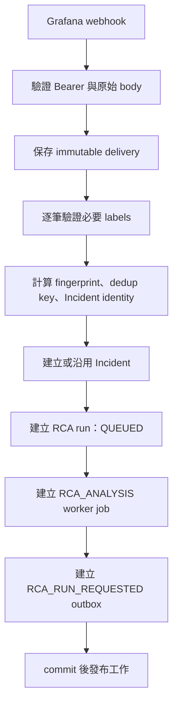

# 跨雲 Grafana Alert 資訊規格

## 1. 目的

本規格定義 Grafana 對 SRE AI Agent 發送 GCP 與 AWS 告警時，alert labels、annotations、Incident identity、驗證與失敗處理的共同格式。

設計目標：

- 讓 GCP 與 AWS 告警進入相同 ingestion pipeline。
- 讓每筆告警都能明確定位雲端帳戶、區域、資源與負責團隊。
- 避免同一 project／account 中不相關的告警被合併成同一 Incident。
- 讓 RCA worker 只在資源定位資料完整時執行。
- 保留 Grafana 原始 webhook，供稽核、重播分析與故障排查。

## 2. 前提與範圍

- Grafana Alert Rule 的維護者保證本規格列出的必要 labels 完整且正確。
- Grafana 使用標準 webhook payload；不以自訂 payload 取代標準 envelope。
- 雲端差異透過標準化 labels 表達；雲端原始欄位可保留為額外 labels。
- 本規格處理 ingestion identity 與 RCA 排程，不處理 Cloud SQL、IAM、網路或基礎設施建置。
- Grafana `resolved` 只更新機器告警狀態，不自動結束人工作業中的 Incident。

參考：

- [Grafana webhook notifier](https://grafana.com/docs/grafana/latest/alerting/configure-notifications/manage-contact-points/integrations/webhook-notifier/)
- [Grafana notification grouping](https://grafana.com/docs/grafana/latest/alerting/fundamentals/notifications/)
- [Google Cloud Monitoring alert troubleshooting](https://cloud.google.com/monitoring/alerts/troubleshooting-alerts)
- [AWS CloudWatch alarm dimensions](https://docs.aws.amazon.com/AmazonCloudWatch/latest/monitoring/CloudWatch_Alarms.html)

## 3. Grafana webhook envelope

系統接收 Grafana 標準 webhook v1。下列 envelope 欄位由 Grafana 產生，不由各告警規則自行拼接：

| 欄位 | 用途 |
|---|---|
| `receiver` | Contact point 名稱 |
| `status` | 整個通知群組的 `firing` 或 `resolved` |
| `orgId` | Grafana organization ID |
| `alerts` | 一至多筆 alert instances |
| `groupLabels` | Grafana notification policy 用來分組的 labels |
| `commonLabels` | 群組內所有 alerts 共用的 labels |
| `commonAnnotations` | 群組內共用 annotations |
| `externalURL` | Grafana 或 Alertmanager URL |
| `version` | Payload 版本 |
| `groupKey` | Grafana 根據 notification grouping 產生的群組識別字串 |
| `truncatedAlerts` | 因 webhook 上限被截斷的 alert 數量 |
| `title` | 通知標題 |
| `message` | 通知訊息 |

`alerts[]` 中每筆 alert 必須保留 Grafana 的：

- `status`
- `labels`
- `annotations`
- `startsAt`
- `endsAt`
- `values`
- `generatorURL`
- `fingerprint`
- `silenceURL`
- `dashboardURL`
- `panelURL`
- `imageURL`

系統使用每筆 alert 的 `status`，不得只使用 envelope 的 `status` 推定所有 alerts 狀態。

## 4. 跨雲必要 labels

每筆 `alerts[]` 必須包含以下 labels：

| Label | 格式與範例 | 說明 |
|---|---|---|
| `alertname` | `GkePodRestart` | 穩定的告警規則名稱，不含動態值 |
| `cloud_provider` | `gcp`、`aws` | 雲端供應商，小寫 |
| `cloud_scope_id` | GCP project ID 或 AWS account ID | 最上層雲端資源範圍 |
| `resource_type` | `gke_pod`、`cloud_sql`、`eks_pod`、`ec2`、`rds` | 本平台定義的標準資源型別 |
| `resource_id` | GCP full resource name 或 AWS ARN／完整資源 ID | 資源的穩定完整識別值 |
| `environment` | `prod`、`uat`、`staging`、`dev` | 部署環境 |
| `service` | `payment-api` | 對使用者有意義的服務名稱 |
| `team` | `platform` | 負責處理 Incident 的團隊 |
| `severity` | `critical`、`warning`、`info` | 告警嚴重度 |
| `signal_type` | `metric`、`log`、`trace`、`synthetic` | 觸發告警的觀測訊號 |

### 4.1 Label 命名規則

- Label key 使用小寫 snake_case。
- 枚舉值使用小寫。
- 不得把密碼、token、credential、完整 log body 或個人資料放入 labels。
- Label value 應穩定、簡短且適合索引；長篇說明放入 annotations。
- `alertname` 不得包含目前數值、時間戳或隨機 ID。
- `resource_id` 不得只填 project／account；必須能識別實際被監控資源。

## 5. 條件式 labels

只要資料來源可提供，下列欄位應一併送出：

| Label | 適用情境 |
|---|---|
| `region` | 區域性資源 |
| `zone` | zonal 資源 |
| `cluster_name` | GKE／EKS |
| `namespace` | Kubernetes 工作負載 |
| `workload` | Deployment、StatefulSet 或服務工作負載 |
| `pod_name` | Pod 級告警 |
| `instance_id` | GCE／EC2 instance |
| `database_id` | Cloud SQL／RDS instance 或 cluster |
| `rule_uid` | Grafana rule UID；Grafana 本身已提供時可保留 |

這些欄位用於搜尋、顯示與 RCA context，不取代核心 Incident identity。

## 6. Annotations 規格

Annotations 提供給操作人員與 AI 閱讀，不作為穩定 identity。

| Annotation | 必要性 | 說明 |
|---|---|---|
| `summary` | 必填 | 一句話描述問題，例如「GKE Pod aaaa 持續重新啟動」 |
| `description` | 必填 | 包含觸發條件、時間窗口與目前值的說明 |
| `info` | 選填 | 保留既有系統的人類可讀訊息 |
| `possible_impact` | 建議 | 可能造成的服務影響 |
| `runbook_url` | 建議 | 對應處理手冊 |
| `owner` | 選填 | 顯示用負責單位；路由仍以 `team` label 為準 |

Annotations 可以修改文案或翻譯，因此不得用 `summary`、`description` 或 `info` 判斷是否為同一 Incident。

## 7. GCP 與 AWS 欄位對照

| 標準欄位 | GCP | AWS |
|---|---|---|
| `cloud_provider` | `gcp` | `aws` |
| `cloud_scope_id` | GCP project ID | 12 位 AWS account ID |
| `region` | GCP region | AWS region |
| `zone` | GCP zone | AWS availability zone |
| `resource_id` | Full resource name，例如 `projects/.../locations/.../clusters/...` | ARN 優先；無 ARN 時使用含 account/region/type 的完整 ID |
| `resource_type` | `gke_pod`、`gce_instance`、`cloud_sql`、`cloud_run` | `eks_pod`、`ec2_instance`、`rds_instance`、`lambda_function` |
| `projectid` | 正規化至 `cloud_scope_id`，原欄位可額外保留 | 不適用 |
| `account_id` | 不適用 | 正規化至 `cloud_scope_id`，原欄位可額外保留 |

GCP alert aggregation 必須保留實際 time-series 的 project ID。若 aggregation 移除 project label，通知可能只剩 scoping project，該告警規則不符合本規格。

AWS metric alarm 必須保留足以識別資源的 dimensions；不能只送 metric namespace 與 alarm name。

## 8. Incident identity 與分組

### 8.1 Canonical Incident identity

每筆 alert 的 Incident identity 為下列欄位的 canonical hash：

```text
source_id
+ cloud_provider
+ cloud_scope_id
+ resource_type
+ resource_id
+ alertname
```

規則：

- 相同 identity 且存在未結案 Incident：沿用該 Incident。
- 相同 identity 的先前 Incident 已由人工結案，再收到 `firing`：建立新 Incident，並以 `reopened_from_incident_id` 連回前一筆。
- identity 不同：建立不同 Incident，即使 team、environment 或 service 相同。
- `resolved` 只更新 alert machine state，不能自動修改 Incident 的 human status。

### 8.2 Grafana `groupKey`

- `groupKey` 與 `groupLabels` 必須原樣保存，供稽核與通知追蹤。
- `groupKey` 不作為長期 Incident identity，因為 notification policy 的 `Group by` 修改後可能改變。
- 同一份 webhook 可以包含多筆 identity 不同的 alerts；系統必須逐筆計算 identity，不得因同一 `groupKey` 強制合併。

### 8.3 Grafana notification policy

建議 `Group by`：

```text
cloud_provider
cloud_scope_id
resource_type
resource_id
alertname
```

這能讓 Grafana 通知分組接近本平台 Incident identity，但 ingestion 仍必須自行驗證每筆 alert。

### 8.4 `fingerprint`

- Grafana 非空 `fingerprint` 用於識別 alert instance 與 delivery dedup。
- `fingerprint` 不單獨作為跨 Grafana source 的 Incident identity。
- 若 Grafana 沒有 fingerprint，系統以 `source_id + sorted labels` 建立 fallback fingerprint。

## 9. 正常處理流程



同一 Incident 在任何時間只能有一個 active RCA run，且每個新 RCA run 只能有一個對應 worker job 與一個具相同 idempotency key 的 outbox event。

## 10. 防禦性驗證失敗流程

雖然上游保證資料完整，ingestion 仍必須 fail closed，以防 Grafana 規則設定漂移。

如果任一必要 label 缺少、空白或格式不合法：

1. Bearer 驗證成功後，保存完整原始 delivery。
2. Delivery／alert validation status 記為 `VALIDATION_FAILED`。
3. 保存缺少或錯誤欄位清單。
4. 不建立 Incident。
5. 不建立 RCA run、worker job 或 RCA outbox。
6. 不查詢 MCP。
7. API 仍回傳已接收的 delivery ID，避免 Grafana 無限重送相同格式錯誤。
8. 前端顯示「告警資料不完整」，供維運人員修正 Grafana rule。

驗證失敗不是正常分類流程；本系統不以猜測、LLM 或 mapping 補齊必要資源 identity。

## 11. GCP 完整範例

```json
{
  "receiver": "sre-agent-webhook",
  "status": "firing",
  "orgId": 1,
  "alerts": [
    {
      "status": "firing",
      "labels": {
        "alertname": "GkePodRestart",
        "cloud_provider": "gcp",
        "cloud_scope_id": "svc-lx-afa-01-uat-1b9a87",
        "resource_type": "gke_pod",
        "resource_id": "projects/svc-lx-afa-01-uat-1b9a87/locations/asia-east1/clusters/cluster-a/namespaces/default/pods/aaaa-7b9f",
        "environment": "uat",
        "service": "aaaa",
        "team": "platform",
        "severity": "warning",
        "signal_type": "metric",
        "region": "asia-east1",
        "cluster_name": "cluster-a",
        "namespace": "default",
        "pod_name": "aaaa-7b9f",
        "projectid": "svc-lx-afa-01-uat-1b9a87"
      },
      "annotations": {
        "summary": "GKE Pod aaaa 持續重新啟動",
        "description": "Pod aaaa-7b9f 在最近 10 分鐘內重新啟動 5 次",
        "info": "gke pod aaaa 服務重啟",
        "possible_impact": "aaaa 服務可能短暫不可用",
        "runbook_url": "https://runbook.example.com/gke/pod-restart"
      },
      "startsAt": "2026-08-12T10:00:00Z",
      "endsAt": "0001-01-01T00:00:00Z",
      "values": {"restart_count": 5},
      "generatorURL": "https://grafana.example.com/alerting/grafana/rules/gke-pod-restart",
      "fingerprint": "gcp-gke-pod-restart-01",
      "silenceURL": "https://grafana.example.com/alerting/silence/new",
      "dashboardURL": "https://grafana.example.com/d/gke",
      "panelURL": "https://grafana.example.com/d/gke?viewPanel=12"
    }
  ],
  "groupLabels": {
    "cloud_provider": "gcp",
    "cloud_scope_id": "svc-lx-afa-01-uat-1b9a87",
    "resource_type": "gke_pod",
    "resource_id": "projects/svc-lx-afa-01-uat-1b9a87/locations/asia-east1/clusters/cluster-a/namespaces/default/pods/aaaa-7b9f",
    "alertname": "GkePodRestart"
  },
  "commonLabels": {},
  "commonAnnotations": {},
  "externalURL": "https://grafana.example.com",
  "version": "1",
  "groupKey": "{}:{alertname=\"GkePodRestart\",cloud_provider=\"gcp\",resource_id=\".../pods/aaaa-7b9f\"}",
  "truncatedAlerts": 0,
  "title": "GKE Pod restart",
  "message": "GKE Pod aaaa 持續重新啟動"
}
```

## 12. AWS 完整範例

```json
{
  "receiver": "sre-agent-webhook",
  "status": "firing",
  "orgId": 1,
  "alerts": [
    {
      "status": "firing",
      "labels": {
        "alertname": "RdsCpuHigh",
        "cloud_provider": "aws",
        "cloud_scope_id": "123456789012",
        "resource_type": "rds_instance",
        "resource_id": "arn:aws:rds:ap-northeast-1:123456789012:db:orders-prod",
        "environment": "prod",
        "service": "orders",
        "team": "commerce",
        "severity": "critical",
        "signal_type": "metric",
        "region": "ap-northeast-1",
        "database_id": "orders-prod",
        "account_id": "123456789012"
      },
      "annotations": {
        "summary": "RDS orders-prod CPU 使用率過高",
        "description": "CPUUtilization 在最近 15 分鐘持續高於 90%",
        "possible_impact": "訂單 API 可能延遲或逾時",
        "runbook_url": "https://runbook.example.com/aws/rds-cpu"
      },
      "startsAt": "2026-08-12T10:00:00Z",
      "endsAt": "0001-01-01T00:00:00Z",
      "values": {"cpu_utilization": 94.2},
      "generatorURL": "https://grafana.example.com/alerting/grafana/rules/rds-cpu-high",
      "fingerprint": "aws-rds-cpu-high-01",
      "silenceURL": "https://grafana.example.com/alerting/silence/new",
      "dashboardURL": "https://grafana.example.com/d/aws-rds",
      "panelURL": "https://grafana.example.com/d/aws-rds?viewPanel=7"
    }
  ],
  "groupLabels": {
    "cloud_provider": "aws",
    "cloud_scope_id": "123456789012",
    "resource_type": "rds_instance",
    "resource_id": "arn:aws:rds:ap-northeast-1:123456789012:db:orders-prod",
    "alertname": "RdsCpuHigh"
  },
  "commonLabels": {},
  "commonAnnotations": {},
  "externalURL": "https://grafana.example.com",
  "version": "1",
  "groupKey": "{}:{alertname=\"RdsCpuHigh\",cloud_provider=\"aws\",resource_id=\"arn:aws:rds:ap-northeast-1:123456789012:db:orders-prod\"}",
  "truncatedAlerts": 0,
  "title": "RDS CPU high",
  "message": "RDS orders-prod CPU 使用率過高"
}
```

## 13. 驗收條件

- GCP 與 AWS 範例都能通過 webhook contract validation。
- 缺少任一必要 label 的 accepted delivery 被標記 `VALIDATION_FAILED`，且沒有 Incident／RCA／job／outbox。
- 同 resource、同 alertname 的 firing update 沿用 active Incident。
- 同 resource、不同 alertname 建立不同 Incident。
- 同 project／account、不同 resource 建立不同 Incident。
- identity 相同但先前 Incident 已人工結案時建立新 Incident，並保留 reopen reference。
- 同一 Grafana webhook 中 identity 不同的 alerts 不被強制合併。
- `resolved` 不修改 human Incident status。
- 只有通過完整 labels 驗證的 alert 才能建立 RCA job 與 outbox。
- 併發接收同 identity 告警時，只建立一個 active Incident、一個 active RCA run、一個 worker job 與一個 outbox idempotency key。
