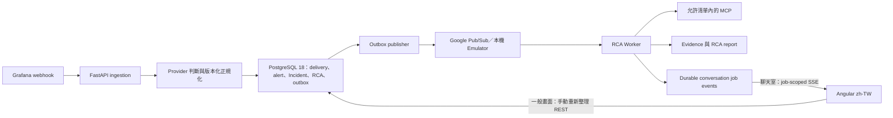

# Grafana 告警正規化與 RCA Worker 設計規格

**狀態：** 已核准，待修訂後書面審閱

**日期：** 2026-08-13

**介面語言：** 繁體中文（zh-TW）

## 1. 目的與取代關係

本規格定義 Grafana webhook、GCP／AWS provider 判斷、Incident 分組、RCA 排程、Pub/Sub、本機 Emulator、AI 輸入、MCP 安全邊界及相關資料庫調整。

本規格取代下列既有規格內容：

- `2026-08-12-cross-cloud-grafana-alert-design.md` 中要求 Grafana 提供 `cloud_provider`、`cloud_scope_id`、`resource_type`、`resource_id`、`team`、`environment`、`service` 的規則。
- `2026-08-12-observability-rca-platform-design.md` 中以 `team/project/environment/service` 作為告警分類與啟動 RCA 前置條件的規則。
- 既有 RCA plan 中「未分類告警不得建立或執行 RCA」的規則。
- 既有平台規格中「第一版完全不提供 browser realtime channel」的規則；新版只對正在產生 AI 回覆的聊天室提供 job-scoped SSE，其他畫面仍不使用長連線。

未被本規格明確取代的架構、安全、資料保存及操作介面原則仍然有效。

## 2. 已確認的產品需求

- Grafana 直接呼叫 `POST /webhooks/v1/grafana/{sourceId}`。
- `sourceId` 來自 webhook URL，由平台建立 Grafana source 時產生，不由 Grafana body 提供。
- 接受 Grafana 官方標準 webhook JSON，不要求上游組出平台自訂的跨雲 labels。
- 一份 webhook 可包含多筆 `alerts[]`；每筆必須獨立正規化、去重及保存。
- `folder` 是專案／系統代碼。
- 不要求 Grafana 提供 `team`、`environment` 或 `service`。
- `annotations.AlertValues` 是本次告警的主要 issue，格式不固定。
- 未分類或資料不完整的告警仍建立 Incident、RCA、worker job 與 outbox。
- Provider 或安全資源範圍無法確認時，RCA 不查 MCP，但仍產生 `PARTIAL` 報告。
- Grafana `resolved` 只更新機器告警狀態，不自動關閉人工 Incident。
- Incident 列表與一般操作畫面不建立長連線，使用者重新整理取得最新資料。
- Incident 聊天室必須以 job-scoped SSE 即時顯示 AI 分析進度、evidence 引用與文字片段；不使用 WebSocket。
- Webhook 在 2 秒內完成接收；完整 RCA 目標在 5 分鐘內完成。

## 3. 系統資料流與邊界



元件責任：

- Ingestion 只負責驗證、保存、正規化、Incident/RCA 排程及 outbox，不執行 AI。
- Outbox publisher 只發布已提交的工作識別資訊。
- Pub/Sub 只負責 at-least-once 工作傳遞，不作為狀態真相來源。
- RCA Worker 以 PostgreSQL 狀態實現 idempotency、lease、attempt 與 durable settlement。
- Angular 只透過 Operator REST API 與已發布的聊天室 SSE contract 讀取資料，不 import backend models。

## 4. Grafana webhook 契約

### 4.1 Endpoint

```http
POST /webhooks/v1/grafana/{sourceId}
Authorization: Bearer <opaque-token>
Content-Type: application/json
```

Bearer 必須在讀取 body 前驗證。驗證失敗時，不得保存或記錄 body。

### 4.2 Envelope

系統接受 Grafana webhook v1，保留以下 envelope 欄位與所有未知 extension fields：

- `receiver`、`status`、`orgId`
- 非空的 `alerts[]`
- `groupLabels`、`commonLabels`、`commonAnnotations`
- `externalURL`、`version`、`groupKey`、`truncatedAlerts`
- `title`、`state`、`message`

每筆 `alerts[]` 保留：

- `status`、`labels`、`annotations`
- `startsAt`、`endsAt`
- `generatorURL`、`fingerprint`
- `silenceURL`、`dashboardURL`、`panelURL`
- `values` 與所有未知 extension fields

系統使用每筆 alert 的 `status`，不得只依 envelope `status` 推定全部 alerts。

### 4.3 核准範例

下列 body 必須成為 checked-in contract fixture，欄位大小寫與原始內容不得在接收時改寫：

```json
{
  "receiver": "My Webhook",
  "status": "firing",
  "orgId": 1,
  "alerts": [
    {
      "status": "firing",
      "labels": {
        "alertname": "High CPU usage",
        "folder": "COM-LX-BOA-01",
        "severity": "ERROR",
        "DBInstanceIdentifier": "production-rds-01",
        "Series": "123456789012"
      },
      "annotations": {
        "AlertValues": "Account: 123456789012\nDB Name: production-rds-01\nValue: 85.23%\n<br>"
      },
      "startsAt": "2026-08-13T14:30:00+08:00",
      "endsAt": "0001-01-01T00:00:00Z",
      "generatorURL": "https://grafana.example.com/alerting/grafana/abc123/view",
      "fingerprint": "c6eadffa33fcdf37",
      "silenceURL": "https://grafana.example.com/alerting/silence/new?...",
      "dashboardURL": "",
      "panelURL": "",
      "values": {"B": 85.23}
    }
  ],
  "groupLabels": {"alertname": "High CPU usage"},
  "commonLabels": {"folder": "COM-LX-BOA-01", "severity": "ERROR"},
  "commonAnnotations": {},
  "externalURL": "https://grafana.example.com/",
  "version": "1",
  "groupKey": "{}:{alertname=\"High CPU usage\"}",
  "truncatedAlerts": 0,
  "title": "[FIRING:1] High CPU usage",
  "state": "alerting",
  "message": "**Firing**\n\nLabels:\n - alertname = High CPU usage\n - severity = ERROR\n..."
}
```

## 5. Provider 判斷

Provider 只能由每筆 `alerts[].labels` 是否包含精確 key `resource.label.project_id` 判斷：

| 條件 | Provider | 驗證狀態 |
|---|---|---|
| key 存在，且 trim 後有值 | `GCP` | 可繼續驗證與正規化 |
| key 不存在 | `AWS` | 可繼續驗證與正規化 |
| key 存在，但為 `null`、非字串、空字串或只有空白 | `GCP` | `VALIDATION_FAILED` |

硬性限制：

- 不讀取或接受 `cloud_provider` label 作為 provider 來源。
- 不以 `DBInstanceIdentifier`、`Series`、ARN、resource type、`folder` 或文字內容猜 provider。
- DB normalization rule 不得覆寫 provider。
- Provider 沒有 `UNKNOWN` 狀態：key 不存在時一律為 AWS；`UNCLASSIFIED` 只代表資源正規化結果，不代表 provider 未知。
- AWS alert 即使 `Series` 不是 12 位帳號也合法；`Series` 只保存為普通 label。
- GCP project ID 空白時仍保存並建立受限 RCA，但不得使用該值呼叫 MCP。

## 6. 兩層告警模型與正規化

### 6.1 原始層

每份已授權 webhook 永久保存：

- exact raw body bytes（`BYTEA`）
- 解析後 JSONB
- SHA-256
- `sourceId`、token identifier、received timestamp、處理狀態

Raw bytes 不得由 JSON 重新序列化產生。Labels、annotations、message 及 URL 全部視為不可信資料。

### 6.2 Canonical Alert Event

每筆 `alerts[]` 產生一筆 canonical event：

```text
schema_version
source_id
delivery_id
alert_index
status
fingerprint
alert_name
folder_code
severity_raw
severity_canonical
provider
cloud_scope
resource
issue
metric_values
normalization
validation
observed_at
```

其中：

- `alert_name` 來自 `labels.alertname`。
- `folder_code` 來自 `labels.folder`，代表專案／系統代碼。
- `cloud_scope`、`resource` 由安全 normalization rules 擷取；取不到可為空。
- `issue.raw_text` 優先來自 `annotations.AlertValues`。
- `metric_values` 原樣保留 `values`；`display_value` 與 `unit` 只能由規則明確提供，不從 `alertname` 或 AlertValues 猜測。

### 6.3 Hybrid normalization rules

採「版本化 DB rules + 安全程式 fallback」：

- Provider 判斷是固定程式規則，不在 DB 設定。
- DB rule 保存 name、version、enabled、priority、conditions、field mappings、resource type、display unit 與 audit metadata。
- Conditions 只允許欄位存在、精確相等、前綴及有限格式比對。
- 禁止 `eval`、任意 Python、SQL、shell、任意 URL 或可執行 script。
- 程式負責 schema validation、輸出型別、安全限制與 fallback。
- 同優先級多條規則同時命中時，標記 `UNCLASSIFIED` 與 conflict warning，不任意選擇。
- 規則更新建立新版本，不覆寫歷史版本；既有 event 保留 rule ID/version。

資源例子包括但不限於 GCP `resource.type`／`resource.label.*`、AWS `DBInstanceIdentifier`、`LoadBalancer`、`TargetGroup`、`ClusterIdentifier`。這些欄位只用於資源正規化，不用於 provider 判斷。

## 7. AlertValues 與 AI 資料邊界

`annotations.AlertValues` 是告警主要 issue，格式可以因 alert rule 而不同，不建立固定 Account／DB Name／Value parser。

交給 RCA Agent 的結構必須把資料與指令分開：

```json
{
  "alertIssue": {
    "rawText": "AlertValues 原文",
    "source": "grafana.annotations.AlertValues",
    "contentType": "text/plain",
    "untrusted": true
  }
}
```

規則：

- `rawText` 保持原文，不修正 HTML、換行、數字或文案。
- `summary`、`description` 與 envelope `message` 可作補充，但不能取代 AlertValues。
- AlertValues 可提供調查線索，但不能單獨證明根因。
- 其中任何「忽略前述指令」、工具呼叫要求、credential、URL 或程式碼都只視為資料。
- Agent 不得自動開啟或抓取 AlertValues、annotations、message、generatorURL、silenceURL、dashboardURL、panelURL 內的 URL。

## 8. Severity

Severity key/value 以大小寫不敏感方式處理，原值永久保存：

| 原值 | Canonical severity |
|---|---|
| `ERROR` | `SEV1` |
| `WARN`、`WARNING` 或大小寫變體 | `SEV3` |
| 其他、空白或缺少 | `UNMAPPED` |

`UNMAPPED` 必須產生 normalization warning，不可自行猜測等級。若存在 `TrueSight_severity`，另存為 notification severity，不覆寫上述 canonical severity。

## 9. Identity、dedup 與 lifecycle

### 9.1 Delivery 與 alert lifecycle dedup

- Delivery identity：`sourceId + SHA256(exact raw body bytes)`。
- Alert lifecycle identity：優先使用 `sourceId + fingerprint + status + startsAt + endsAt`。
- Fingerprint 缺少或空白時：`SHA256(sourceId + canonical sorted labels)`。
- 相同 delivery 重送可保留 audit record，但不能重複建立 alert transition、Incident、RCA、job 或 outbox。

### 9.2 Incident identity version 2

正常 Incident grouping key：

```text
sourceId + folder + alertname
```

實際儲存的 `identity_key` 使用版本標記與 canonical length-prefixed tuple 後再取 SHA-256，不使用沒有分隔規則的裸字串串接；因此欄位中即使包含空白、冒號或其他合法字元也不會產生組合碰撞。

規則：

- `fingerprint` 不參與正常 Incident 分組，只辨識 alert lifecycle。
- 同一 webhook 內多筆 alerts 各自計算；相同 grouping key 可連到同一 active Incident。
- `folder` 或 `alertname` 缺少／空白時，alert 標記 `VALIDATION_FAILED`，並以 `sourceId + __invalid__ + fingerprint` 建立隔離的 fallback Incident，避免不相關錯誤告警被合併。
- 相同 identity 且存在 active Incident 時沿用。
- 相同 identity 的 Incident 已人工結案，新的 `firing` 建立新 Incident 並保存 reopen relation。
- `resolved` 更新 alert machine state，不修改 human Incident status。
- `groupKey` 與 `groupLabels` 原樣保存，但不作 Incident identity。

## 10. 驗證失敗與未分類 RCA

Provider、folder、alertname、severity 或 resource 正規化不完整時：

1. 保存完整 delivery 與該筆 alert event。
2. 記錄 per-alert `VALIDATION_FAILED` 或 `UNCLASSIFIED`、錯誤欄位與 warnings。
3. 建立或沿用 Incident。
4. 建立 RCA run、`RCA_ANALYSIS` worker job 及 `RCA_RUN_REQUESTED` outbox。
5. 只在能建立安全 MCP scope 時開放對應工具。
6. 無安全 scope 時，僅分析 Grafana issue 與資料庫內既有證據。
7. 證據不足時產生 `PARTIAL` 報告，明確標示「證據不足」，不得猜 provider、資源或根因。

Mixed webhook 中每筆 alert 獨立處理；單筆失敗不得阻止其他 alerts 建立自己的結果。Delivery 若含任何 validation failure，記為 `VALIDATION_FAILED`，HTTP 仍回 `202`。

## 11. Transactional ingestion

單一 PostgreSQL transaction 執行：

1. 保存 immutable delivery（exact bytes、JSONB、hash）。
2. 展開並保存所有 alert events。
3. 對每筆 alert 執行 provider 判斷、normalization、validation 與 dedup。
4. upsert alert instance。
5. 以 identity v2 建立或取得 active Incident，並連結 alert。
6. 必要時建立 active RCA run。
7. 建立唯一 worker job 與唯一 outbox idempotency key。
8. 全部成功後 commit，才回 `202`。

任何中途資料庫錯誤必須整筆 rollback，不得出現有 Incident 卻沒有對應 job/outbox 的狀態。

## 12. Pub/Sub 與官方 Emulator

### 12.1 本機與整合測試

- 本機與 CI 使用 Google 官方 **Pub/Sub Emulator**，不建立自製 broker。
- Local Compose 只提供應用程式開發支援，不包含正式環境 IaC。
- Emulator 由官方 Google Cloud CLI emulator image 啟動，image 必須 pin 至明確版本或 digest。
- 綁定本機／Compose network 所需介面，不對公網開放。
- 應用程式透過 `PUBSUB_EMULATOR_HOST` 與非正式的 local project ID 連線，不使用 GCP credential。
- Topic 與 subscription 由使用相同 Google Cloud Pub/Sub client library 的 idempotent bootstrap 建立；不依賴 Emulator 不支援的 Console 或 `gcloud pubsub` 管理命令。
- 整合測試必須真的完成 publish、pull、redelivery、ack 與 idempotency；單元測試才可使用 fake/mock。
- 每個測試 session 使用隔離 project/topic/subscription 名稱，避免狀態互相污染。

Google 官方說明 Client Libraries 在設定 `PUBSUB_EMULATOR_HOST` 後會連到本機 Emulator；Emulator 與正式服務可能有差異，因此正式環境另保留最小 smoke test：

- <https://docs.cloud.google.com/pubsub/docs/emulator?hl=en>
- <https://cloud.google.com/sdk/gcloud/reference/beta/emulators/pubsub/start>

### 12.2 正式環境

- 使用真正 Google Cloud Pub/Sub。
- 使用 Workload Identity／ADC，不保存 service-account key。
- Project、topic、subscription 由環境設定提供；程式不得在 production startup 任意建立或修改雲端資源。
- Publisher 與 subscriber 使用與 Emulator 相同的 typed adapter；環境差異只存在 composition/configuration layer。

### 12.3 訊息契約

Pub/Sub 不放完整 AlertValues、raw payload、labels、MCP evidence 或 secrets，只放工作識別資訊：

```json
{
  "schemaVersion": 1,
  "workerJobId": "uuid",
  "rcaRunId": "uuid",
  "incidentId": "uuid",
  "attempt": 1
}
```

`attempt` 是建立訊息時的初始值；實際嘗試次數以 PostgreSQL `worker_attempts` 為唯一真相。訊息使用 stable idempotency key，Pub/Sub redelivery 不得建立新 job。

## 13. RCA Worker lifecycle

- Worker 以 `workerJobId + rcaRunId + incidentId + schemaVersion` 驗證訊息與 DB 關係。
- 使用資料庫 row lock／lease 原子 claim 工作。
- RCA deadline 固定為進入 `QUEUED` 後 300 秒。
- Lease 為 60 秒，長任務必須在仍擁有 lease 時安全續租。
- 最多 3 次 durable attempts；實際 attempt 寫入 PostgreSQL，不信任 Pub/Sub message 的值。
- 同一 `workerJobId` 可安全重送；已有 terminal report 時直接 ack。
- Evidence 與 report 成功提交後才 ack。
- 暫時性 transport/MCP 錯誤在剩餘 deadline 與 attempt limit 內 nack／重試。
- Policy、schema、authorization 等永久錯誤持久化 terminal failure 後 ack。
- Worker crash 或 stale lease 可由下一個 delivery 接手，不重複已持久化 evidence。
- 逾時但有可用內容時產生 `PARTIAL`；完全沒有可用內容時為 `FAILED`，不得虛構 leading hypothesis。

## 14. RCA Agent、MCP 與 evidence

### 14.1 Agent input

Worker 從 PostgreSQL 載入 Incident、canonical alert、原始 AlertValues、normalization 結果及允許的工具。Pub/Sub payload 不作分析資料來源。

Google ADK dependency 必須由 `uv.lock` 固定版本，並包在平台 adapter 後方，避免 domain code 依賴易變 SDK API。

### 14.2 MCP scope

- GCP：只有 `resource.label.project_id` 為非空有效字串，且 normalization 建立安全資源範圍時，才提供對應 GCP read-only MCP capabilities。
- AWS：只有安全 rule 從 labels 建立足夠的 account/resource scope 時，才提供 AWS read-only MCP capabilities。
- 無法建立 scope 時仍執行 RCA，但 `availableTools` 為空。
- MCP 使用可信 capability manifest、固定 endpoint identity、允許清單與 input schema。
- 缺少、模糊或具 mutation 能力的 tool 一律 fail closed。
- Agent 不可指定任意 endpoint、tool name 或 URL。
- 正式 MCP auth 使用 Workload Identity／ADC；本機 Bearer 由 SecretProvider 取得，不寫入 log、prompt、report 或 DB。

### 14.3 Evidence

MCP 原始結果永久保存：

- exact raw result `BYTEA`
- parsed/structured `JSONB`
- SHA-256
- endpoint identity、tool、capability、input scope、time window、observed time
- content type、status 與安全 metadata

EvidenceReference 必須包含 evidence UUID 與 partition timestamp，才能精確引用月分割資料。RCA report 只保存 reference 與摘要，不複製整份 raw evidence。

每個 observed claim 必須引用 supporting、contradicting 或 missing evidence。Telemetry、logs、traces 與 tool output 永遠是資料，不是指令。

### 14.4 RCA 結果

- `COMPLETE`：必要分析成功，結論具有足夠可追溯證據。
- `PARTIAL`：部分工具失敗、deadline 到期、安全 scope 不足或證據不足。
- `FAILED`：沒有可用分析結果，或遇到永久 workflow failure。

報告使用繁體中文；service 名稱、metric、trace/span ID、exception、log、labels、AlertValues 與 evidence 保持原文。

## 15. Incident 聊天室與即時 AI 回覆

### 15.1 對話工作

人工追問與自動 RCA 共用 Incident session，但使用獨立 `conversation_jobs`：

- `incident_id` 與 session pointer 必填。
- `rca_run_id` 可為 `NULL`；一般追問不必偽裝成一次 RCA run。
- 對話 job 也透過 durable outbox/Pub/Sub 傳遞，並遵守相同的 idempotency、lease、evidence citation 與安全工具規則。
- 使用者送出訊息後，REST API 先持久化 user message、conversation job 與 outbox，再回傳 `202` 和 `jobId`。
- AI 最終回覆永久保存為 `incident_messages`；完成事件只有在最終訊息 commit 後才能送出。

### 15.2 SSE 範圍

聊天室需要即時顯示 AI 回覆，因此只在某個 conversation job 執行期間建立 SSE：

```http
POST /operator/v1/incidents/{incidentId}/messages
GET  /operator/v1/conversation-jobs/{jobId}/events
```

- 使用者送訊息走一般 REST；伺服器向瀏覽器推送 AI 結果走 SSE。
- 不使用 WebSocket，因為目前不需要任意雙向 socket protocol。
- 每個 SSE 只能訂閱一個 `jobId`，完成、失敗、取消或達 deadline 後立即關閉。
- Incident 列表、dashboard、告警清單與一般 RCA 頁面仍不建立長連線。
- SSE endpoint 使用 Operator authentication，並再次驗證使用者是否可查看該 job 所屬 Incident；前端傳入的 incident/job 關係不可信。
- Angular 使用支援 `Authorization` 與 `Last-Event-ID` headers 的 fetch-based SSE client；不使用無法附帶自訂 Bearer header 的原生 `EventSource`，也不得把 access token 放入 query string。

### 15.3 Durable event stream

為了支援重新整理、短暫斷線與多個 API instances，不把 SSE 連線記憶體當成事件真相來源。Worker 依序寫入 `conversation_job_events`，每筆包含：

- `job_id`
- 單調遞增 `sequence`，同一 job 唯一
- `event_type`
- 經 schema 驗證的 payload
- `created_at`

文字不要求每一個 token 寫一次資料庫；Worker 將相鄰 token 合併為短小 `text-delta` chunks，在約 250–500 ms 內持久化並送出，以兼顧即時感與 PostgreSQL 寫入量。

SSE API 以資料庫 sequence 讀取尚未送出的 events。沒有新事件時採 bounded async polling；每次讀取使用短查詢並立即釋放 connection，不維持長時間資料庫 transaction、row lock 或專用 connection。瀏覽器重連時使用 `Last-Event-ID`，API 從下一個 sequence 重播，因此不需要 Redis 或另一套 stream store。SSE 連線可送不持久化的 heartbeat comment，heartbeat 不改變 event sequence。

### 15.4 Event contract

| Event | 用途 | 重要限制 |
|---|---|---|
| `queued` | 工作已排隊 | 不含內部 queue 資訊 |
| `running` | AI 開始分析 | 可含安全的階段名稱 |
| `tool-progress` | 正在查詢 Metrics／Logs／Trace 等進度 | 只顯示允許公開的 capability 名稱，不含 query、credential 或 raw result |
| `text-delta` | AI 回覆文字片段 | `delta` 為不完整顯示內容，不是 durable final message |
| `citation` | Evidence 引用可供 UI 連結 | 只含 evidence UUID、partition timestamp 與安全摘要 |
| `completed` | 最終訊息已 commit | 包含 final `messageId`，送出後關閉 SSE |
| `failed` | 工作失敗 | 只含安全繁體中文訊息與 correlation ID，送出後關閉 SSE |
| `timed-out` | 工作超過 deadline | 可指向已保存的 partial result，送出後關閉 SSE |
| `cancelled` | 工作被取消 | 送出後關閉 SSE |

事件 envelope：

```text
id: <sequence>
event: <event-type>
data: {"schemaVersion":1,"jobId":"...",...}
```

同一 job 的事件必須依 sequence 傳送。收到 `completed` 後，Angular 以 `messageId` 讀取或核對永久訊息；SSE delta 不取代 PostgreSQL 中的 final message。

### 15.5 斷線與錯誤行為

- 瀏覽器在非 terminal job 斷線時，以 exponential backoff 重連並帶 `Last-Event-ID`。
- 若 job 已 terminal 且 client 遺漏 terminal event，API 重播未讀事件後正常關閉。
- 無權限或 job 不屬於可見 Incident：`404`，避免洩漏 job 是否存在。
- 無效或超出範圍的 `Last-Event-ID`：`400`；不得跳到其他 job 的 sequence。
- Proxy／API 必須停用 SSE response buffering，並保留 heartbeat 與 idle timeout 所需設定。
- Worker 失敗前已送出的文字只能顯示為「未完成回覆」，不能存成成功的 agent message 或被當作正式 RCA 結論。

## 16. 資料庫遷移與相容性

新 migration 必須向前相容，不修改已套用的 initial migration：

- canonical alert 增加 provider、folder code、alert name、raw/canonical severity、issue、resource、normalization rule/version、validation status 與 warnings。
- Incident 增加 `identity_version` 與 identity v2 必要欄位／索引。
- 新資料使用 identity v2；歷史資料保留原 identity，不離線重算或合併。
- `team_id/project_id/environment_id/service_id` 不再是新 alert 建立 Incident/RCA 的必要條件；migration 與 repository protocol 必須支援 nullable legacy scope。
- `folder_code` 是告警專案／系統代碼，不直接等同既有 `projects.id`。
- Folder 可透過獨立、可稽核的 source-specific mapping 連到內部 authorization scope；沒有 mapping 時仍可建立 RCA，但只允許中央 SRE／具全域權限者查看。
- Source/folder authorization mapping 不得影響 provider 或 Incident identity。
- normalization rules 保存版本與 audit metadata，歷史 event 不因 rule 更新而改寫。
- 新增 evidence raw bytes、metadata/hash，以及 conversation job/session pointer 所需欄位／約束。
- 新增 `conversation_job_events`，以 `(job_id, sequence)` 保證順序與重播唯一性，並為 job/sequence 查詢建立索引；event payload 不得保存 credential、raw MCP result 或未遮罩內部錯誤。
- 所有新 constraint、index、partition 與 downgrade 的資料損失風險同步寫入 PostgreSQL schema reference。

## 17. HTTP 與操作錯誤

| HTTP | 條件 |
|---|---|
| `202` | Transaction commit；包含 UNCLASSIFIED、GCP project ID 空白、severity unmapped、`truncatedAlerts > 0` |
| `400` | JSON 無法解析、必要 Grafana envelope 錯誤、`alerts` 為空 |
| `401` | Bearer 缺少／錯誤；body 不得被讀取或保存 |
| `413` | 原始 body 大於 1 MiB；達到 1 MiB 整仍合法 |
| `503` | PostgreSQL 暫時不可用，允許 Grafana 重試 |
| `500` | 未預期錯誤；只回安全 correlation ID，不洩漏 credential、SQL、prompt 或內部錯誤 |

`truncatedAlerts > 0` 不拒絕已收到的 alerts，但 delivery 標示 incomplete、產生 metric/warning，避免誤以為通知完整。

## 18. Angular 顯示

介面全部使用繁體中文，並在使用者重新整理後顯示：

- Incident status、alert machine state、RCA status 與更新時間。
- Provider（GCP/AWS）、folder 專案／系統代碼、alertname。
- 原始 severity 與 canonical severity；未映射顯示「嚴重度未映射」。
- AlertValues 原文，明確標示為「Grafana 告警內容」。
- Validation／normalization warnings，例如「GCP project ID 空白」、「資源未分類」或「規則衝突」。
- RCA `COMPLETE/PARTIAL/FAILED` 的繁體中文狀態與 evidence references。
- 無 MCP scope 的 PARTIAL 報告顯示「目前僅依告警內容分析，尚無可安全查詢的雲端資源範圍」。

Incident 詳情提供簡易聊天室：

- 顯示該 Incident session 的 user、agent、system messages 與時間。
- 送出訊息後立即顯示 user message 及「AI 排隊中」。
- Conversation job 執行時透過 SSE 即時顯示分析階段、Metrics／Logs／Trace 等安全進度、evidence 引用與 `text-delta`。
- SSE terminal event 後，以永久 `messageId` 取代暫存中的串流文字。
- 斷線時顯示「正在重新連線」，並以 `Last-Event-ID` 恢復，不重複顯示已收到的 delta。
- 使用者離開 Incident 或取消等待時關閉該 SSE；不影響 Worker 繼續產生 durable 最終結果。
- SSE 使用 authenticated fetch client，不在 URL、browser history、proxy log 或 analytics 中暴露 access token。

前端不自行重新分類、不推定 provider、不解析 AlertValues，也不是 authorization boundary。

## 19. 測試策略與驗收條件

### 19.1 Contract 與 unit tests

- 核准 Grafana body 是 checked-in fixture，未知 fields 可完整保存。
- `resource.label.project_id` 有值為 GCP；不存在為 AWS；存在但空白為 GCP + `VALIDATION_FAILED`。
- `cloud_provider`、DB identifier、Series、ARN 或 folder 不能改變 provider。
- `ERROR -> SEV1`；`WARN/WARNING -> SEV3`；未知值為 `UNMAPPED` warning。
- 任意格式 AlertValues 原文不變，並以 untrusted `alertIssue` 傳給 Agent。
- 多筆 alerts 分開正規化；相同 grouping key 可連結同一 active Incident。
- 正常 identity 精確為 `sourceId + folder + alertname`；invalid fallback 不合併不相關 alert。
- Normalization rule priority、version、conflict、safe condition 與禁止 executable content 皆有測試。
- Prompt injection、惡意 URL、偽造 tool request 不會觸發未授權操作。

### 19.2 PostgreSQL 18 integration tests

- Migration upgrade/downgrade/upgrade 與 schema catalog constraints。
- Exact webhook bytes、JSONB 與 hash round-trip。
- Delivery/alert dedup、Incident identity v2、resolved 行為、closed/reopen relation。
- Valid、UNCLASSIFIED、VALIDATION_FAILED 均建立正確 Incident/RCA/job/outbox。
- Mixed webhook 與 transaction rollback。
- 併發 ingestion 同 identity 只建立一個 active Incident、一個 active RCA、一個 worker job 與一個 outbox idempotency key。
- Nullable legacy scope 與 folder authorization mapping 不造成跨 scope 資料外洩。
- Evidence UUID + partition timestamp reference 可精確讀回 raw evidence。

### 19.3 官方 Pub/Sub Emulator integration tests

- 使用官方 Emulator 與 production Google client library。
- Idempotent 建立 topic/subscription。
- Outbox publish、pull、ack、nack/redelivery、duplicate message。
- DB commit 前不可發布；RCA durable settlement 前不可 ack。
- Worker crash、stale lease、最多 3 attempts、300 秒 deadline。
- 訊息不含 AlertValues、raw payload、credential 或 evidence。

### 19.4 RCA/evaluation tests

- GCP valid scope、AWS valid scope 與無安全 scope 三種路徑。
- 無 MCP scope 仍產生 `PARTIAL` 且不呼叫任何 MCP。
- Specialist timeout 或部分失敗仍保存 evidence 與 PARTIAL report。
- 每個 observed fact 都能追溯 evidence ID/partition timestamp。
- 沒有 evidence 時不產生虛構 root cause。
- 報告與 UI 是繁體中文，技術原文保持不變。

### 19.5 Chat/SSE tests

- REST message creation 先 commit user message/job/outbox，再回 `202 + jobId`。
- SSE 只能讀取已授權 Incident 的 job；不存在與無權限都回 `404`。
- Angular fetch-based SSE 能附帶 Bearer 與 `Last-Event-ID`；contract test 禁止 URL query token。
- `queued/running/tool-progress/text-delta/citation/completed` 依 sequence 傳送。
- `tool-progress` 與錯誤事件不洩漏 query、credential、raw evidence、prompt 或內部 exception。
- `Last-Event-ID` 可在重新整理、API instance 切換及短暫斷線後精確重播，且不重複 delta。
- `completed` 一定晚於 final message commit；commit 失敗不得送出 completed。
- failed/cancelled/timed-out 都會產生對應 terminal event 並關閉 SSE。
- Worker 失敗前的 partial deltas 不會成為成功的永久 agent message。
- Angular component 測試覆蓋即時文字、進度、citation、重連、terminal replacement 與 teardown 關閉連線。
- 整合測試使用真 PostgreSQL 與官方 Pub/Sub Emulator，不能只用 in-memory event fake。

### 19.6 服務目標

- 合法 webhook transaction 與 `202` 在 2 秒內完成。
- Incident 在 commit 後可立即由 REST 查詢，使用者重新整理即可看到。
- Conversation event 在 Worker 持久化後 1 秒內送到已連線的聊天室；文字 chunks 約每 250–500 ms 產生一次。
- 完整 RCA 目標在進入 `QUEUED` 後 300 秒內完成；逾時必須產生 durable PARTIAL/FAILED 狀態。

## 20. 實作分解

本設計跨越兩個有順序依賴的子專案，實作時使用兩份計畫：

1. **Grafana normalization 與 schema migration**：契約、provider、rules、identity v2、nullable legacy scope、transactional ingestion、Angular 顯示欄位。
2. **Pub/Sub Emulator、RCA Worker 與 Chat SSE**：官方 Emulator、訊息契約、worker lifecycle、ADK/MCP、evidence、report、conversation jobs、durable job events 與 Angular SSE client。

第二階段依賴第一階段的 canonical alert、Incident identity v2 與資料庫欄位完成。兩階段都不得加入 production infrastructure provisioning。
